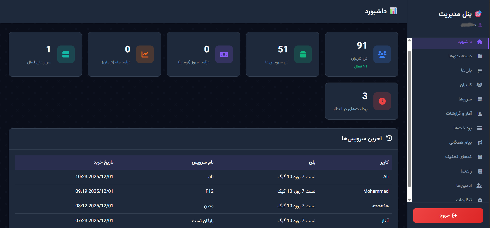
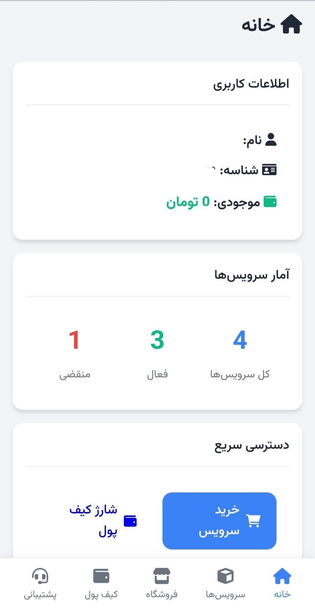

# WizardPanel Pro (Enhanced Web Edition) 🚀

> **نسخه پیشرفته و توسعه‌یافته WizardPanel با پنل مدیریت وب و مینی‌اپ تلگرام**

این پروژه یک فورک اساسی و توسعه‌یافته از [WizardPanel](https://github.com/webwizards-team/wizardpanel) است. در حالی که نسخه اصلی صرفاً یک ربات تلگرام CLI بود، این نسخه با افزودن **رابط کاربری تحت وب (Web Interface)**، قدرت مدیریت و کاربری را به سطح کاملاً جدیدی ارتقا داده است.

---

## ✨ ویژگی‌های جدید و متمایز (New Features)

تغییر اصلی در این نسخه، اضافه شدن پوشه `web/` است که شامل دو بخش مجزا و قدرتمند می‌باشد:

### 1. 🌐 پنل مدیریت تحت وب (Web Admin Panel)
دیگر نیازی نیست همه کارها را با دستورات تلگرام انجام دهید! اکنون یک پنل مدیریت کامل در اختیار دارید:
- **مدیریت داشبورد:** مشاهده آمار فروش، کاربران آنلاین و وضعیت سرورها به صورت گرافیکی.
- **مدیریت کاربران:** مشاهده لیست کامل کاربران، موجودی، سرویس‌ها و ویرایش اطلاعات آنها.
- **مدیریت سرورها:** افزودن و ویرایش سرورهای Marzban/Sanaei/Marzneshin از طریق وب.
- **مدیریت پلن‌ها و دسته‌بندی‌ها:** تعریف قیمت، حجم و مدت زمان سرویس‌ها با رابط کاربری آسان.
- **مدیریت مالی:** مشاهده و تایید/رد درخواست‌های افزایش موجودی و کارت‌به‌کارت.
- **سیستم تیکتینگ:** پاسخگویی به تیکت‌های پشتیبانی کاربران از محیط وب.
- **ارسال همگانی:** ارسال پیام به همه کاربران با سرعت بالا.

### 2. 📱 مینی‌اپ تلگرام (User Mini App)
تجربه کاربری مدرن برای مشتریان شما با استفاده از Telegram Web App:
- **خرید و تمدید آسان:** رابط کاربری گرافیکی برای انتخاب سرور و پلن.
- **کیف پول پیشرفته:** امکان افزایش موجودی، آپلود رسید کارت‌به‌کارت و مشاهده تراکنش‌ها.
- **مشاهده سرویس‌ها:** نمایش وضعیت سرویس، حجم باقی‌مانده و تاریخ انقضا با گرافیک زیبا.
- **پشتیبانی:** ارسال تیکت و دریافت پاسخ در محیط چت‌مانند.
- **احراز هویت امن:** لاگین خودکار و ایمن با استفاده از داده‌های تلگرام.


---

## 📂 ساختار فایل‌ها (File Structure)

```
src/
├── api/                # ارتباط با پنل‌های مرزبان و ...
├── includes/           # توابع و تنظیمات اصلی (هسته ربات)
├── web/                # <--- بخش جدید اضافه شده
│   ├── assets/         # فایل‌های CSS, JS, Images
│   ├── pages/          # صفحات پنل ادمین (Users, Plans, Servers...)
│   ├── user/           # صفحات مینی‌اپ کاربر (Wallet, Shop, Renew...)
│   ├── login.php       # صفحه ورود ادمین
│   └── index.php       # داشبورد اصلی
├── bot.php             # هسته ربات تلگرام
└── install.php         # اسکریپت نصب خودکار
```

---

## 🛠 نصب و راه‌اندازی (Installation)

1. **آپلود فایل‌ها:** کل محتویات پوشه `src` را در هاست خود آپلود کنید.
2. **نصب:** فایل `install.php` را در مرورگر اجرا کنید تا دیتابیس ساخته شود.
3. **تنظیم وبهوک:** وبهوک ربات را به فایل `bot.php` ست کنید.
4. **تنظیم وب‌اپ:** در BotFather، آدرس `https://your-domain.com/web/user/` را به عنوان Menu Button URL تنظیم کنید.

#

---

## 📸 اسکرین‌شات‌ها

*پنل ادمین*



*پنل مینی اپ*


---

## ❤️ تقدیر و تشکر
این پروژه بر پایه هسته قدرتمند [WizardPanel](https://github.com/webwizards-team/wizardpanel) بنا شده و با هدف ارائه تجربه کاربری بهتر توسعه یافته است.
